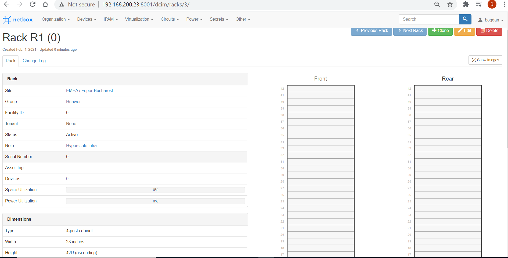

# netbox-ansible  [](https://hits.seeyoufarm.com)

***
  - [0. How to install Ansible Galaxy collection to correct path:](#0-how-to-install-ansible-galaxy-collection-to-correct-path)
  - [1. How the NetBox objects are expressed as IaC, using the py script in dir _IaC_ to create phy devices with mgmt IP, mgmt interface, rack position, site and more](#1-how-the-netbox-objects-are-expressed-as-iac-using-the-py-script-in-dir-iac-to-create-phy-devices-with-mgmt-ip-mgmt-interface-rack-position-site-and-more)
    - [Each device is expressed in terms of some extra-vars sent to Ansible playbooks as input:](#each-device-is-expressed-in-terms-of-some-extra-vars-sent-to-ansible-playbooks-as-input)
    - [Taking info from an .xls file, the py script creates and populates yaml files with the values of a template overriten](#taking-info-from-an-xls-file-the-py-script-creates-and-populates-yaml-files-with-the-values-of-a-template-overriten)
  - [2. How to add all physical appliances with management IPs](#2-how-to-add-all-physical-appliances-with-management-ips)
    - [Add in NetBox, by calling external_vars.yml files as extra-var:](#add-in-netbox-by-calling-external_varsyml-files-as-extra-var)
    - [Or use a bash script to optimize Ansible creation:](#or-use-a-bash-script-to-optimize-ansible-creation)
    - [To add only part of IaC list:](#to-add-only-part-of-iac-list)
      - [range of devices:](#range-of-devices)
      - [add specific phyisical device in NetBox with mgmt IP address:](#add-specific-phyisical-device-in-netbox-with-mgmt-ip-address)
    - [Results in Netbox WebUI > Racks page:](#results-in-netbox-webui--racks-page)
  - [3. Add phy interfaces](#3-add-phy-interfaces)
    - [To configure data-plane interfaces of phy device, we can use NAPALM py library to connect to NOS devices (ToR switches) and parse live their configuration and using _ansible-runner_ py library, call Ansible playbooks to update devices (with LAG ID, trunk/access mode, VLANs) by a py3 script - in dir __NAPALM/__](#to-configure-data-plane-interfaces-of-phy-device-we-can-use-napalm-py-library-to-connect-to-nos-devices-tor-switches-and-parse-live-their-configuration-and-using-ansible-runner-py-library-call-ansible-playbooks-to-update-devices-with-lag-id-trunkaccess-mode-vlans-by-a-py3-script---in-dir-napalm)
  - [4. Add VMs and IP plan](#4-add-vms-and-ip-plan)
    - [To configure VMs and IP prefixes and addresses for virtual interfaces (VM interfaces and VLANifs), we can use the py3 script getting input from an .xls file - in dir __IPplan/__](#to-configure-vms-and-ip-prefixes-and-addresses-for-virtual-interfaces-vm-interfaces-and-vlanifs-we-can-use-the-py3-script-getting-input-from-an-xls-file---in-dir-ipplan)
  - [5. How to integrate NAPALM with Containerized NetBox, to allow for real-time collecting of facts in NetBox, from its network devices objects, based on netbox-docker guide](#5-how-to-integrate-napalm-with-containerized-netbox-to-allow-for-real-time-collecting-of-facts-in-netbox-from-its-network-devices-objects-based-on-netbox-docker-guide)
    - [How to configure the NetBox with credentials for the Network OS devices it will NAPALM calls to:](#how-to-configure-the-netbox-with-credentials-for-the-network-os-devices-it-will-napalm-calls-to)
    - [How to assign NAPALM driver to a NetBox device:](#how-to-assign-napalm-driver-to-a-netbox-device)
      - [1. Create a platform where the driver section is filled with "junos" for the default Juniper NAPALM driver or "ce" for the _napalm-ce_ driver for Huawei devices](#1-create-a-platform-where-the-driver-section-is-filled-with-junos-for-the-default-juniper-napalm-driver-or-ce-for-the-napalm-ce-driver-for-huawei-devices)
      - [2. Edit device and assign platform](#2-edit-device-and-assign-platform)
    - [How to check if a NAPALM driver is installed in NetBox:](#how-to-check-if-a-napalm-driver-is-installed-in-netbox)
    - [How to rebuild image from the _netboxcommunity/netbox:latest_ in Docker Hub, while adding napalm-driver in Dockerfile:](#how-to-rebuild-image-from-the-netboxcommunitynetboxlatest-in-docker-hub-while-adding-napalm-driver-in-dockerfile)
  - [6. How to backup the PostgreSQL database of NetBox and the uploaded files (like images) and to restore, per netbox-docker official wiki](#6-how-to-backup-the-postgresql-database-of-netbox-and-the-uploaded-files-like-images-and-to-restore-per-netbox-docker-official-wiki)
    - [DB Operations:](#db-operations)
    - [File Operations:](#file-operations)
  - [7. How to clear all NetBox database]
  (#7-how-to-clear-all-netbox-database)    
  - [8. How to get NetBox access over HTTPS, by placing a Reverse-Proxy in front of it, like Caddy, per [netbox-docker guide](https://github.com/netbox-community/netbox-docker/wiki/TLS)](#7-how-to-get-netbox-access-over-https-by-placing-a-reverse-proxy-in-front-of-it-like-caddy-per-netbox-docker-guide)
    - [create a server certificate (like from Vault PKI) with SANs: DNS Name=netbox.dnszone, IP Address=192.168.x.x, IP Address=127.0.0.1](#create-a-server-certificate-like-from-vault-pki-with-sans-dns-namenetboxdnszone-ip-address192168xx-ip-address127001)
    - [configure the Caddy Reverse Proxy](#configure-the-caddy-reverse-proxy)
    - [to troubleshoot check Caddy RP container logs:](#to-troubleshoot-check-caddy-rp-container-logs)
    - [how to connect to NetBox (with HTTP to HTTPS forwarding):](#how-to-connect-to-netbox-with-http-to-https-forwarding)
      - [open SSH tunnel and forward 192.168.x.x:443 to localhost:xyz (` ssh -i ~/.ssh/id_rsa user@bastion -L xyz:192.168.x.x:443`), then use https://localhost:xyz/ or https://127.0.0.1:xyz/ in browser](#open-ssh-tunnel-and-forward-192168xx443-to-localhostxyz--ssh--i-sshid_rsa-userbastion--l-xyz192168xx443-then-use-httpslocalhostxyz-or-https127001xyz-in-browser)
      - [OR open dynamic SOCKS5 tunnel (` ssh -i ~/.ssh/id_rsa user@bastion -D zyx `) and set SOCKS5 proxy 127.0.0.1:zyx and pass DNS through it in browser (Mozilla Firefox), then use https://netbox.tooling.neo/ or https://192.168.x.x/ in browser](#or-open-dynamic-socks5-tunnel-ssh--i-sshid_rsa-userbastion--d-zyx-and-set-socks5-proxy-127001zyx-and-pass-dns-through-it-in-browser-mozilla-firefox-then-use-httpsnetboxtoolingneo-or-https192168xx-in-browser)

***

## Ansible playbooks usage for Netbox automation, based on [Galaxy collection](https://docs.ansible.com/ansible/latest/collections/netbox/netbox/).
[](http://inch-ci.org/github/bogdanadrian-burciu/netbox-ansible)
## 0. How to install Ansible Galaxy collection to correct path:

boburciu@WX-5CG020BDT2:~$ ` ansible-config list | grep COLLECTIONS_PATHS -C1 ` _# verify default location for the collections, so that the new modules can be read by Ansible cfg_
```
    Ansible version
COLLECTIONS_PATHS:
  default: ~/.ansible/collections:/usr/share/ansible/collections
--
  env:
  - name: ANSIBLE_COLLECTIONS_PATHS
  - name: ANSIBLE_COLLECTIONS_PATH
 
boburciu@WX-5CG020BDT2:~$
boburciu@WX-5CG020BDT2:~$
``` 
boburciu@WX-5CG020BDT2:~$ ` ansible-galaxy collection install netbox.netbox --collections-path ~/.ansible/collections ` _# installing the collection of roles in proper location_


## 1. How the NetBox objects are expressed as IaC, using the py script in dir _IaC_ to create phy devices with mgmt IP, mgmt interface, rack position, site and more

### Each device is expressed in terms of some extra-vars sent to Ansible playbooks as input:
boburciu@WX-5CG020BDT2: $  `cd ~/netbox-ansible-automation`  <br/>
boburciu@WX-5CG020BDT2:~/netbox-ansible-automation$ `cat external_vars.yml ` <br/>
```# external_vars.yml to be used in playbooks called in order by import_playbook

url_var: http://192.168.200.23:8001/
token_var: ***********************

## ======== variables used for NetBox WebUI Organization tab objects ======== ##
tag_name: ' '   
tag_description: ' '   
tag_color: FFA500  # RGB color in hexadecimal, use https://htmlcolorcodes.com/
#
region_name: ' '   
#
site_name: ' '   
site_status: Planned
site_region: EMEA
site_facility: Hyperscale DC
site_asn: ' '       # found by trial and error that needs to be integer
site_time_zone: ' '   
site_description: ' '   
site_physical_address: ' '   
site_shipping_address: ' '   
site_latitude: ' '    # found by trial and error the need to ensure  there are no more than 8 digits in total  
site_longitude: ' '   # found by trial and error the need to ensure  there are no more than 9 digits in total  
site_contact_name: ' '   
site_contact_phone: ' '   
site_contact_email: ' '   
#
tenant_group_name: ' '   
tenant_name: ' '                    # found by trial and error that does not support underscore, for VRF to be referenced to its name
tenant_description: ' '
# tenant_comments: "SDN backend"
tenant_tag: oiaas
#
rack_group_name: ' '    
rack_site: ' '   
rack_role_name: Hyperscale infra
rack_role_color: DF2E08
rack_name: ' '
rack_desc_units: no   # rack units will be numbered top-to-bottom, yes or no
rack_outer_unit: Millimeters   # whether the rack unit is in Millimeters or Inches and is required if outer_width/outer_depth is specified
rack_outer_width: 605   # per https://www.ibm.com/support/pages/overview-ibm-42u-and-47u-1200-mm-deep-static-and-deep-dynamic-rack
rack_outer_depth: 1200
rack_type: 4-post cabinet    # Choices: 2-post frame, 4-post frame, 4-post cabinet, Wall-mounted frame, Wall-mounted cabinet
rack_u_height: 42
rack_width: 23     # the rail-to-rail width, choices: 10, 19, 21, 23
rack_serial: 00000000
rack_facility_id: ' '            # found by trial and error that fields group & facility_id must make a unique set for a rack
rack_comments: ' '


##  ======== variables used for NetBox WebUI Devices tab objects ======== ##
device_manufacturer_name: ' '
device_model: ' '
device_part_number: ' '
device_u_height: ' '  # found by trial and error that it needs to be 0 if parent type is "child"
device_is_full_depth: no    # whether or not the device consumes both front and rear rack faces, yer or no
device_subdevice_role: ' '      # whether the device type is parent (which has device bays), child (which must be installed within a device bay), or neither
device_hw_set_id: ' '          # just a tag for the set of hardware params above; found by trial and error that it should not be part of model of manufacturer, i.e. CE6851 is not accepted 
#
device_role_name: ' '
device_role_color: ' '
#
device_hostname: ' '
device_site: ' '   
device_face: front    # front/rear, found by trial and error that needs not be used if parent type is "child"
device_primary_ip4: ' '
device_serial: ' '
device_rack_name: ' '
device_position_in_rack: ' '   # found by trial and error that needs not be used if parent type is "child"
device_tenant: ' '
device_comments: ' '
device_tag: ' '   
#
device_bay_chassis: Chassis1    # device the device bay will be associated to. The device type must be "parent".
device_bay_slot: 1
device_bay_blade: ' ' # device that will be installed into the bay. The device type must be "child" and 0U
#
interface_device: ' '
interface_name: ' '
interface_mac_address: ' '   
interface_enabled: true
interface_type: 1000BASE-T
interface_mtu: 1500
interface_mgmt_only: yes      # interface is used only for out-of-band management, yes or no
interface_description: Mgmt interface
#
cable_end_a_host: SWH-OoB-R2
cable_end_a_if: GE1/0/1
cable_end_b_host: ' '   
cable_end_b_if: iBMC
cable_type: mmf-om4

##  ======== variables used for NetBox WebUI IPAM tab objects ======== ##
vrf_name: OOB
vrf_rd: ' '   
vrf_description: OOB for underlay switches and firewalls and IPMI network of servers
vrf_tag: oiaas
#
ip_addr_address: ' '
ip_addr_vrf: OOB
ip_addr_tenant: ' '
ip_addr_status: Reserved
ip_addr_role: VIP     # the role of the IP address: Loopback, Secondary, Anycast, VIP, VRRP, HSRP, GLBP, CARP
ip_addr_description: Mgmt interface
ip_addr_interface_name: ' '
ip_addr_interface_device: ' '
```

### Taking info from an .xls file, the py script creates and populates yaml files with the values of a template overriten

boburciu@WX-5CG020BDT2:~/netbox-ansible-automation$ ` python3 IaC/xls2iac.py ` 

boburciu@WX-5CG020BDT2:~/netbox-ansible-automation$ ` ls -lt IaC/ `
```
total 28
-rw-rw-rw- 1 boburciu boburciu 10253 Apr  5 21:08 'Physical appliances 4 IaC.xlsx'
-rw-rw-rw- 1 boburciu boburciu  4077 Feb 10 18:44  xls2iac.py
-rwxrw-rw- 1 boburciu boburciu  4238 Feb 10 10:31  run_ansible_optimized.sh
-rwxrw-rw- 1 boburciu boburciu  1576 Feb  8 21:22  get_iac_unique_var.sh
boburciu@WX-5CG020BDT2:~/netbox-ansible-automation$
```


## 2. How to add all physical appliances with management IPs

boburciu@WX-5CG020BDT2: /netbox-ansible-automation$ ` cd ../parse_excel_servers/; python3 xls2iac.py; cd ../netbox-ansible-automation/ ` <br/>
boburciu@WX-5CG020BDT2: /netbox-ansible-automation$ ` ls -lt ~/parse_excel_servers/ | grep external_vars_ ` <br/>
```
-rw-rw-rw- 1 boburciu boburciu   4589 Feb  7 01:42 external_vars_******.yml
-rw-rw-rw- 1 boburciu boburciu   4585 Feb  7 01:42 external_vars_*******.yml
-rw-rw-rw- 1 boburciu boburciu   4635 Feb  7 01:42 external_vars_********.yml
-rw-rw-rw- 1 boburciu boburciu   4631 Feb  7 01:42 external_vars_*********.yml
:
boburciu@WX-5CG020BDT2:~/netbox-ansible-automation$
```
### Add in NetBox, by calling external_vars.yml files as extra-var:
boburciu@WX-5CG020BDT2:~/netbox-ansible-automation$ ` for i in `ls -lt ~/parse_excel_servers/ | grep external_vars_ | awk '{print $9}'`; do echo ""; echo ""; echo "***** running playbook for variables in $i *****"; echo ""; echo ""; echo ""; ansible-playbook -i ./hosts create_device_wMgmtIntIP_inRack_inTenant_inRack_inSite.yml -e "external_vars='../parse_excel_servers/$i' ansible_python_interpreter='/usr/bin/python3'" -v; done `  <br/>

### Or use a bash script to optimize Ansible creation:
` ./IaC/run_ansible_optimized.sh -d ~/parse_excel_servers/ `

### To add only part of IaC list:
#### range of devices:
 boburciu@WX-5CG020BDT2:~/netbox-ansible-automation$ ` ls -lX /home/boburciu/parse_excel_servers/external_vars*  | awk '{print $9}'  | cat -n | tail -36 `
 ```
    51  /home/boburciu/parse_excel_servers/external_vars_******.yml
    :
    86  /home/boburciu/parse_excel_servers/external_vars_******.yml
```    
boburciu@WX-5CG020BDT2: /netbox-ansible-automation$  ` for x in ` ls -lX /home/boburciu/parse_excel_servers/external_vars*  | awk '{print $9}'  | cat | tail -36  `; do echo ""; echo ""; echo "@@@@@ running Device creation playbooks for extra-vars in $x @@@@@"; echo ""; echo ""; echo ""; ansible-playbook -i ./hosts -v add_device_w_mgmt.yml -e "external_vars=$x"; done `

#### add specific phyisical device in NetBox with mgmt IP address:
boburciu@WX-5CG020BDT2: /netbox-ansible-automation$ ` ansible-playbook -i ./hosts -v create_device_wMgmtIntIP_inRack_inTenant_inRack_inSite.yml -e "external_vars=/home/boburciu/parse_excel_servers/external_vars_******.yml" `

### Results in Netbox WebUI > Racks page:



## 3. Add phy interfaces

### To configure data-plane interfaces of phy device, we can use NAPALM py library to connect to NOS devices (ToR switches) and parse live their configuration and using _ansible-runner_ py library, call Ansible playbooks to update devices (with LAG ID, trunk/access mode, VLANs) by a py3 script - in dir __NAPALM/__

boburciu@WX-5CG020BDT2:~/netbox-ansible-automation$ ` ls -lt NAPALM/ `
``` 
total 68
-rw-rw-rw- 1 boburciu boburciu  3542 Apr  5 21:27 napalm_calls_4_py_shell.py
-rw-rw-rw- 1 boburciu boburciu 20291 Apr  5 21:26 huawei-napalm2netbox.py
-rw-rw-rw- 1 boburciu boburciu 23519 Apr  5 21:25 dell-napalm2netbox.py
-rwxrwxrwx 1 boburciu boburciu 20395 Apr  5 21:23 README.md
boburciu@WX-5CG020BDT2:~/netbox-ansible-automation$
``` 

## 4. Add VMs and IP plan

### To configure VMs and IP prefixes and addresses for virtual interfaces (VM interfaces and VLANifs), we can use the py3 script getting input from an .xls file - in dir __IPplan/__
boburciu@WX-5CG020BDT2:~/netbox-ansible-automation$ ` ls -lt IPplan/ `
```
total 380
-rw-rw-rw- 1 boburciu boburciu   9552 Apr  5 21:51 ip-plan2netbox.py
-rw-rw-rw- 1 boburciu boburciu 376320 Apr  5 21:47 IP_plan_4_NetBox.xls
boburciu@WX-5CG020BDT2:~/netbox-ansible-automation$
```

## 5. How to integrate NAPALM with Containerized NetBox, to allow for real-time collecting of facts in NetBox, from its network devices objects, based on [netbox-docker guide](https://github.com/netbox-community/netbox-docker/wiki/NAPALM-Configuration)

### How to configure the NetBox with credentials for the Network OS devices it will NAPALM calls to:
[root@NetboX netbox-docker]# ` vi /root/projects/netbox-docker/env/netbox.env ` <br/>
[root@NetboX netbox-docker]# ` cat /root/projects/netbox-docker/env/netbox.env | grep NAPALM ` <br/>
```  
NAPALM_USERNAME=user
NAPALM_PASSWORD=pass
NAPALM_TIMEOUT=10
[root@NetboX netbox-docker]#
```  
[root@NetboX netbox-docker]# ` pip3 install napalm ` <br/>
[root@NetboX netbox-docker]# ` pip3 install napalm-ce ` <br/>
[root@NetboX netbox-docker]# ` docker-compose restart ` <br/>
```  
Restarting netbox-docker_nginx_1         ... done
Restarting netbox-docker_netbox_1        ... done
Restarting netbox-docker_netbox-worker_1 ... done
Restarting netbox-docker_redis-cache_1   ... done
Restarting netbox-docker_postgres_1      ... done
Restarting netbox-docker_redis_1         ... done
[root@NetboX netbox-docker]#
``` 

### How to assign NAPALM driver to a NetBox device:

#### 1. Create a platform where the driver section is filled with "junos" for the default Juniper NAPALM driver or "ce" for the _napalm-ce_ driver for Huawei devices

#### 2. Edit device and assign platform


### How to check if a NAPALM driver is installed in NetBox:
[root@NetboX netbox-docker]# ` docker-compose run --rm --entrypoint /bin/bash netbox `
``` 
Creating netbox-docker_netbox_run ... done
``` 
bash-5.0$ ` ./manage.py nbshell `
``` 
🧬 loaded config '/etc/netbox/config/configuration.py'
🧬 loaded config '/etc/netbox/config/configuration.py'
🧬 loaded config '/etc/netbox/config/extra.py'
### NetBox interactive shell (d9fceee54b53)
### Python 3.9.1 | Django 3.1.3 | NetBox 2.10.3
### lsmodels() will show available models. Use help(<model>) for more info.
>>> 
>>>
>>> import napalm
>>> driver=napalm.get_network_driver("ce")
Traceback (most recent call last):
  File "<console>", line 1, in <module>
  File "/usr/local/lib/python3.9/site-packages/napalm/base/__init__.py", line 97, in get_network_driver
    raise ModuleImportError(
napalm.base.exceptions.ModuleImportError: Cannot import "ce". Is the library installed?
>>> exit()
bash-5.0$ exit
exit
[root@NetboX netbox-docker]#
``` 

### How to rebuild image from the _netboxcommunity/netbox:latest_ in Docker Hub, while adding napalm-driver in Dockerfile:
[root@NetboX netbox-docker]# ` vi Dockerfile ` <br/>
[root@NetboX netbox-docker]# ` diff Dockerfile Dockerfile.bkp ` <br/>
```
26d25
<       napalm-ce \
79c78
< RUN chmod -R g+w static media
---
> RUN mkdir static && chmod -R g+w static media
[root@NetboX netbox-docker]#

```
[root@NetboX netbox-docker]# ` mkdir .netbox ` <br/>
[root@NetboX netbox-docker]# ` touch .netbox/requirements.txt ` <br/>
[root@NetboX netbox-docker]# ` cat .netbox/requirements.txt ` <br/>
```
napalm==3.2.0
napalm-ce==0.2.0
ruamel.yaml==0.16.13
django-auth-ldap==2.3.0
django-storages[azure,boto3,dropbox,google,libcloud,sftp]==1.11.1
[root@NetboX netbox-docker]#
```
[root@NetboX netbox-docker]# ` docker image build . --tag netbox:napalm --build-arg FROM=netboxcommunity/netbox:latest --build-arg NETBOX_PATH=".netbox" `
```
Sending build context to Docker daemon  158.7kB
Step 1/30 : ARG FROM
:

Successfully built 3ab20b99381c
Successfully tagged netbox:napalm
[root@NetboX netbox-docker]# [root@NetboX netbox-docker]# docker image ls
REPOSITORY               TAG           IMAGE ID       CREATED          SIZE
netbox                   napalm        3ab20b99381c   45 seconds ago   336MB
postgres                 12-alpine     7ec50832fed0   8 weeks ago      159MB
redis                    6-alpine      933c79ea2511   2 months ago     31.6MB
netboxcommunity/netbox   latest        8e452c542927   2 months ago     229MB
nginx                    1.19-alpine   629df02b47c8   3 months ago     22.3MB
[root@NetboX netbox-docker]#
```
[root@NetboX netbox-docker]# ` cp docker-compose.yml docker-compose.yml.bkp ` <br/>
[root@NetboX netbox-docker]# ` vi docker-compose.yml ` <br/>
[root@NetboX netbox-docker]# ` diff docker-compose.yml docker-compose.yml.bkp ` <br/>
```
4c4
<     image: netbox:napalm
---
>     image: netboxcommunity/netbox:${VERSION-latest}
[root@NetboX netbox-docker]#
```
[root@NetboX netbox-docker]# ` docker-compose ps `
```
Name   Command   State   Ports
------------------------------
[root@NetboX netbox-docker]#
```
[root@NetboX netbox-docker]# ` docker-compose up `
```
Creating network "netbox-docker_default" with the default driver
Creating netbox-docker_redis-cache_1   ... done
Creating netbox-docker_postgres_1    ... done
Creating netbox-docker_redis_1       ... done
Creating netbox-docker_netbox-worker_1 ... done
Creating netbox-docker_netbox_1        ... done
Creating netbox-docker_nginx_1         ... done
Attaching to netbox-docker_postgres_1, netbox-docker_redis_1, netbox-docker_redis-cache_1, netbox-docker_netbox-worker_1, netbox-docker_netbox_1, netbox-docker_nginx_1

```
[root@NetboX netbox-docker]# ` docker-compose ps `
```
            Name                           Command               State                           Ports
------------------------------------------------------------------------------------------------------------------------------
netbox-docker_netbox-worker_1   python3 /opt/netbox/netbox ...   Up
netbox-docker_netbox_1          /opt/netbox/docker-entrypo ...   Up
netbox-docker_nginx_1           /docker-entrypoint.sh ngin ...   Up      80/tcp,
                                                                         0.0.0.0:8001->8080/tcp,0.0.0.0:49154->8080/tcp
netbox-docker_postgres_1        docker-entrypoint.sh postgres    Up      5432/tcp
netbox-docker_redis-cache_1     docker-entrypoint.sh sh -c ...   Up      6379/tcp
netbox-docker_redis_1           docker-entrypoint.sh sh -c ...   Up      6379/tcp
[root@NetboX netbox-docker]# 
```
[root@NetboX netbox-docker]# ` docker ps `
```
CONTAINER ID   IMAGE                COMMAND                  CREATED         STATUS         PORTS                                                     NAMES
055cd02cd6a0   nginx:1.19-alpine    "/docker-entrypoint.…"   3 minutes ago   Up 3 minutes   80/tcp, 0.0.0.0:8001->8080/tcp, 0.0.0.0:49154->8080/tcp   netbox-docker_nginx_1
e541d6a00f8e   netbox:napalm        "/opt/netbox/docker-…"   3 minutes ago   Up 3 minutes                                                             netbox-docker_netbox_1
441f071d94dd   netbox:napalm        "python3 /opt/netbox…"   3 minutes ago   Up 3 minutes                                                             netbox-docker_netbox-worker_1
4c3c5d0de41d   redis:6-alpine       "docker-entrypoint.s…"   3 minutes ago   Up 3 minutes   6379/tcp                                                  netbox-docker_redis_1
8bea76d9a0dd   postgres:12-alpine   "docker-entrypoint.s…"   3 minutes ago   Up 3 minutes   5432/tcp                                                  netbox-docker_postgres_1
5fff97d26517   redis:6-alpine       "docker-entrypoint.s…"   3 minutes ago   Up 3 minutes   6379/tcp                                                  netbox-docker_redis-cache_1
[root@NetboX netbox-docker]#
```

## 6. How to backup the PostgreSQL database of NetBox and the uploaded files (like images) and to restore, per [netbox-docker official wiki](https://github.com/netbox-community/netbox-docker/wiki/Troubleshooting#database-operations)

### DB Operations:

Access the database:

```bash
docker-compose exec postgres sh -c 'psql -U $POSTGRES_USER $POSTGRES_DB'
```

Take a database backup

```bash
docker-compose exec -T postgres sh -c 'pg_dump -cU $POSTGRES_USER $POSTGRES_DB' | gzip > db_dump.sql.gz
```

Restore that database:

```bash
# Stop all NetBox instances that access the db
docker-compose stop netbox netbox-worker

# Restore the DB dump
gunzip -c db_dump.sql.gz | docker-compose exec -T postgres sh -c 'psql -U $POSTGRES_USER $POSTGRES_DB'
```

### File Operations:

Backup of the _media_ directory, which contains uploaded images.

```bash
docker-compose exec -T netbox tar c -jf - -C /opt/netbox/netbox/media ./ > media-backup.tar.bz2
```

Restore of the _media_ directory:

> ⚠️ This may overwrite files in the media directory!

```bash
docker-compose exec -T netbox tar x -jvf - -C /opt/netbox/netbox/media < media-backup.tar.bz2 
```

## 7. How to clear all NetBox database 
#### (including users - except default *admin/admin*)
[root@gitlab-runner-and-netbox netbox-docker]# `cat docker-compose.yml`
```
version: '3.4'
services:
:
  # postgres
  postgres:
    image: postgres:12-alpine
    env_file: env/postgres.env
    volumes:
    - netbox-postgres-data:/var/lib/postgresql/data
:
volumes:
:
  netbox-postgres-data:
    driver: local
:
```
[root@gitlab-runner-and-netbox netbox-docker]# `docker volume ls`
```
DRIVER    VOLUME NAME
:
local     netbox-docker_netbox-postgres-data
:
```
[root@gitlab-runner-and-netbox netbox-docker]# `docker volume inspect netbox-docker_netbox-postgres-data`
```
[
    {
        "CreatedAt": "2021-08-19T12:19:36+03:00",
        "Driver": "local",
        "Labels": {
            "com.docker.compose.project": "netbox-docker",
            "com.docker.compose.version": "1.27.4",
            "com.docker.compose.volume": "netbox-postgres-data"
        },
        "Mountpoint": "/var/lib/docker/volumes/netbox-docker_netbox-postgres-data/_data",
        "Name": "netbox-docker_netbox-postgres-data",
        "Options": null,
        "Scope": "local"
    }
]
[root@gitlab-runner-and-netbox netbox-docker]#
```
[root@gitlab-runner-and-netbox netbox-docker]# `ls -lt /var/lib/docker/volumes/netbox-docker_netbox-postgres-data/_data`
```
total 60
drwx------. 2 70 70    63 Aug 19 12:35 pg_stat_tmp
drwx------. 4 70 70    68 Aug 19 12:24 pg_logical
drwx------. 2 70 70  4096 Aug 19 12:19 global
drwx------. 2 70 70     6 Aug 19 12:19 pg_stat
-rw-------. 1 70 70    94 Aug 19 12:19 postmaster.pid
-rw-------. 1 70 70    24 Aug 19 12:19 postmaster.opts
drwx------. 2 70 70    18 Aug 19 12:19 pg_notify
drwx------. 3 70 70    92 Apr  2 18:09 pg_wal
drwx------. 6 70 70    54 Jan 25  2021 base
-rw-------. 1 70 70  4782 Jan 25  2021 pg_hba.conf
drwx------. 2 70 70    18 Jan 25  2021 pg_subtrans
drwx------. 2 70 70    18 Jan 25  2021 pg_xact
-rw-------. 1 70 70  1636 Jan 25  2021 pg_ident.conf
-rw-------. 1 70 70    88 Jan 25  2021 postgresql.auto.conf
-rw-------. 1 70 70 26580 Jan 25  2021 postgresql.conf
drwx------. 2 70 70     6 Jan 25  2021 pg_commit_ts
drwx------. 2 70 70     6 Jan 25  2021 pg_dynshmem
drwx------. 4 70 70    36 Jan 25  2021 pg_multixact
drwx------. 2 70 70     6 Jan 25  2021 pg_replslot
drwx------. 2 70 70     6 Jan 25  2021 pg_serial
drwx------. 2 70 70     6 Jan 25  2021 pg_snapshots
drwx------. 2 70 70     6 Jan 25  2021 pg_tblspc
drwx------. 2 70 70     6 Jan 25  2021 pg_twophase
-rw-------. 1 70 70     3 Jan 25  2021 PG_VERSION
[root@gitlab-runner-and-netbox netbox-docker]#
```
[root@gitlab-runner-and-netbox netbox-docker]# `rm -rf /var/lib/docker/volumes/netbox-docker_netbox-postgres-data/_data`
[root@gitlab-runner-and-netbox netbox-docker]# `ls -lt /var/lib/docker/volumes/netbox-docker_netbox-postgres-data/_data`
```
ls: cannot access /var/lib/docker/volumes/netbox-docker_netbox-postgres-data/_data: No such file or directory
[root@gitlab-runner-and-netbox netbox-docker]#
```
[root@gitlab-runner-and-netbox netbox-docker]# `mkdir /var/lib/docker/volumes/netbox-docker_netbox-postgres-data/_data`
[root@gitlab-runner-and-netbox netbox-docker]# `docker-compose down`
[root@gitlab-runner-and-netbox netbox-docker]# `docker-compose up`
```
netbox-docker_redis-cache_1 is up-to-date
netbox-docker_redis_1 is up-to-date
netbox-docker_netbox-worker_1 is up-to-date
Creating netbox-docker_postgres_1 ... done
Attaching to netbox-docker_redis-cache_1, netbox-docker_redis_1, netbox-docker_netbox-worker_1, netbox-docker_postgres_1, netbox-docker_netbox_1, netbox-docker_nginx_1
:
postgres_1       | CREATE DATABASE
postgres_1       |
:
postgres_1       | PostgreSQL init process complete; ready for start up.
:
netbox_1         | ✅ Initialisation is done.
netbox_1         | [2021-08-19 09:42:47 +0000] [1] [INFO] Starting gunicorn 20.0.4
netbox_1         | [2021-08-19 09:42:47 +0000] [1] [INFO] Listening at: http://0.0.0.0:8001 (1)
```

###  How to find PostgreSQL database version in container
[root@gitlab-runner-and-netbox netbox-docker]# `docker-compose exec postgres sh -c 'psql -U $POSTGRES_USER -d $POSTGRES_DB -V'`
```
psql (PostgreSQL) 12.5
[root@gitlab-runner-and-netbox netbox-docker]#
```

## 8. How to get NetBox access over HTTPS, by placing a Reverse-Proxy in front of it, like [Caddy](https://hub.docker.com/_/caddy?tab=description), per [netbox-docker guide](https://github.com/netbox-community/netbox-docker/wiki/TLS)

### create a server certificate (like from Vault PKI) with SANs: DNS Name=netbox.dnszone, IP Address=192.168.x.x, IP Address=127.0.0.1
ubuntu@netbox-vm:~/vault$ ` sudo mv vault_netbox_key_1.key ../netbox-docker/vault_netbox_key_ipsan.key ` <br/>
ubuntu@netbox-vm:~/vault$ ` sudo mv vault_netbox_cert_1.crt ../netbox-docker/vault_netbox_cert_ipsan.crt ` <br/>

### configure the [Caddy](https://hub.docker.com/_/caddy?tab=description) Reverse Proxy
ubuntu@netbox-vm:~/netbox-docker$ ` cat Caddyfile `
```
# ./Caddyfile
{
        default_sni 192.168.x.x       # will use this IP as TLS SNI for all ClientHello s that come without one (like when IP address is used in URL instead of hostname); Caddy needs to see SNI, otherwise it returns TLS Alert
}

 netbox.dnszone, localhost, 192.168.x.x, 127.0.0.1 {
    reverse_proxy netbox:8080
    encode gzip zstd
    file_server
    tls /etc/ssl/private/cert_ipsan.crt /etc/ssl/private/key_ipsan.key
    # or:
    # tls /etc/ssl/private/cert.pem

    log {
      level error
    }
}
```
ubuntu@netbox-vm:~/netbox-docker$ ` cat docker-compose.override.yml `
```
services:
  tls:
    image: caddy:2-alpine
    depends_on:
      - netbox
    volumes:
      - /home/ubuntu/netbox-docker/vault_netbox_cert_ipsan.crt:/etc/ssl/private/cert_ipsan.crt:ro,z
      - /home/ubuntu/netbox-docker/vault_netbox_key_ipsan.key:/etc/ssl/private/key_ipsan.key:ro,z
      - /home/ubuntu/netbox-docker/Caddyfile:/etc/caddy/Caddyfile:ro
    ports:
      - 80:80   # Allows for http redirection
      - 443:443
```
ubuntu@netbox-vm:~/netbox-docker$ ` sudo docker-compose down ` <br/>
ubuntu@netbox-vm:~/netbox-docker$ ` sudo docker-compose up& ` <br/>

### to troubleshoot check Caddy RP container logs:
ubuntu@netbox-vm:~/netbox-docker$ ` sudo docker-compose logs tls `
```
Attaching to netbox-docker_tls_1
:
tls_1            | {"level":"info","ts":1620325857.0710692,"logger":"http","msg":"skipping automatic certificate management because one or more matching certificates are already loaded","domain":"netbox.dnszone","server_name":"srv0"}
tls_1            | {"level":"info","ts":1620325857.0712597,"logger":"http","msg":"skipping automatic certificate management because one or more matching certificates are already loaded","domain":"192.168.x.x","server_name":"srv0"}
tls_1            | {"level":"info","ts":1620325857.0714242,"logger":"http","msg":"skipping automatic certificate management because one or more matching certificates are already loaded","domain":"127.0.0.1","server_name":"srv0"}
tls_1            | {"level":"info","ts":1620325857.0714638,"logger":"http","msg":"enabling automatic HTTP->HTTPS redirects","server_name":"srv0"}
:
ubuntu@netbox-vm:~/netbox-docker$
```

### how to connect to NetBox (with HTTP to HTTPS forwarding):
   #### open SSH tunnel and forward 192.168.x.x:443 to localhost:xyz (` ssh -i ~/.ssh/id_rsa user@bastion -L xyz:192.168.x.x:443`), then use https://localhost:xyz/ or https://127.0.0.1:xyz/ in browser
   #### OR open dynamic SOCKS5 tunnel (` ssh -i ~/.ssh/id_rsa user@bastion -D zyx `) and set SOCKS5 proxy 127.0.0.1:zyx and pass DNS through it in browser (Mozilla Firefox), then use https://netbox.tooling.neo/ or https://192.168.x.x/ in browser
